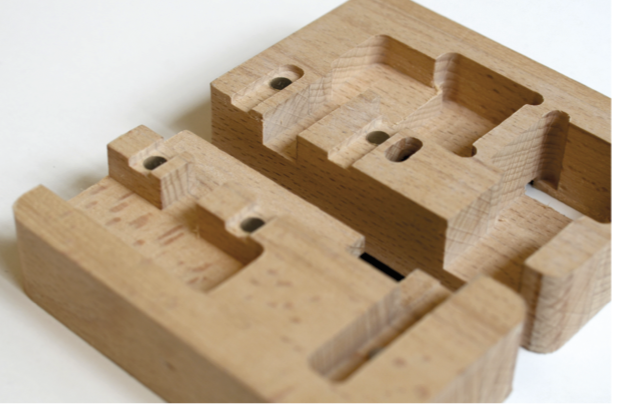
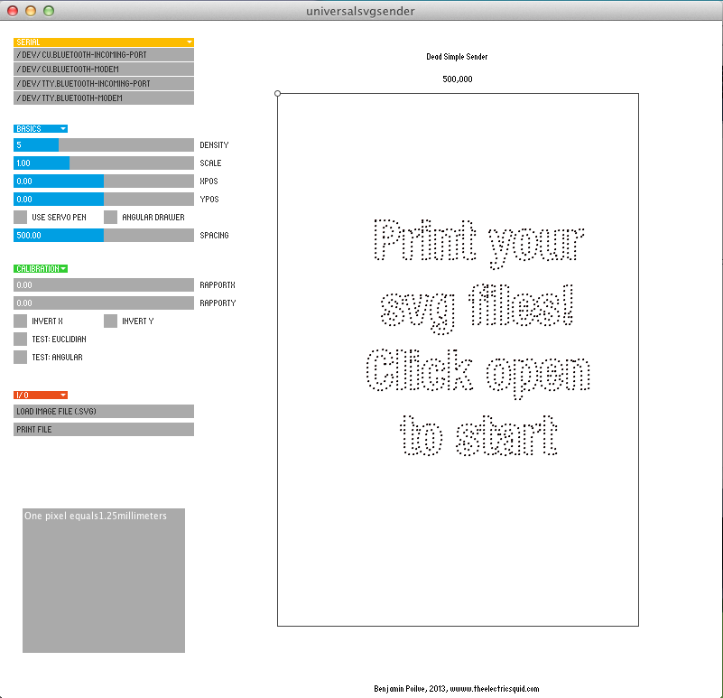
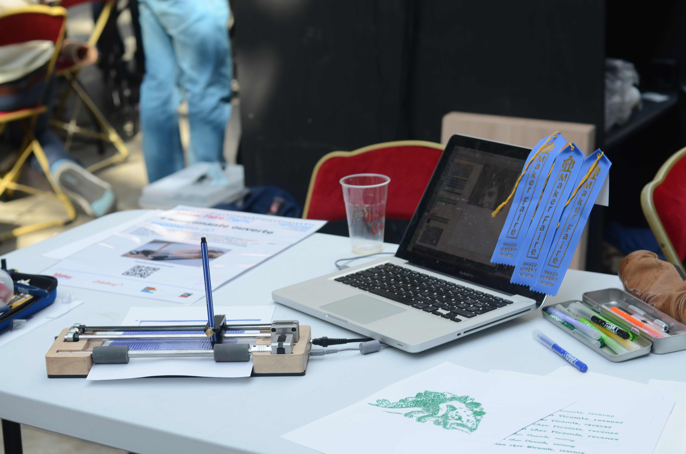

# Liplo

> You can find an article about my adventures with plotters [here](https://www.benjaminpoilve.com/projects/plotter-story.html#)


An easy-to-assemble and fun-to-use pen plotter.

[](https://www.youtube.com/watch?v=27pN25DA5TU&t=17s)

(click on the gif to have a video of all the iterations of Liplo)

The goal of this project is to imagine an easy to use and simple desktop printer, open to experimentations. Being able to use a wide array of tools (pen, pencil, brush) and paper types, it allows to really discover the world of CNC tools. Control of the printer can be done through a software that uses vector drawing, or through processing with the help of a simple software library, to discover generative drawing.


This is an old project of mine, I tried to make it a product (see my repo [LiploV2](https://github.com/BenjaminPoilve/LiploV2)) but I failed to manage the operational part of it. I put it on github in case it might inspire someone!


## The build


The construction is based on standard pieces. This allows the user to buy those pieces cheaply. 

The parts that need to be made are:

* Some laser cut parts for the head as well as the bottom of the machine
* Two CNC routed wood pieces
* A bended spring steel plate

The last one is the harder to manufacture. I did not find any manufacturer that made such parts. If you have an industrial metal bender at hand, this is pretty easy to do, but most people dont. This piece is used to maintain pressure between the paper and the roller.

On the electronic's side, I decided to use an [EibotBoard](http://www.schmalzhaus.com/EBB/). This is a very sturdy piece of hardware, that can be [bought](https://shop.evilmadscientist.com/productsmenu/188) quite cheaply. Both motor are Nema 14. I recommand [Robotdigg](https://www.robotdigg.com/) for most hardware purchase.

The last part of this project that is quite fun is that the axis are held in place only by magnet inserted in the wood. This allow for a very easy assembly.

#### B.O.M.

| Part   |      Approximate Price      |  Link |
|----------|:-------------:|:------:|
| EBB | $50 |    [link](https://shop.evilmadscientist.com/productsmenu/188) |
| 2 Nema 14 Stepper 26mm |  $16.74|  [link](https://www.omc-stepperonline.com/nema-14-stepper-motor/nema-14-bipolar-18deg-14ncm-20ozin-04a-12v-35x35x26mm-4-wires-14hs10-0404s.html) |
| Power HD DS44 servomotor | $12 |     |
| Acetal Copolymer hinge |    $3.5   | [link](https://shop.evilmadscientist.com/partsmenu/200-hinges)   |
| Wood |    $10  |   local seller  |
| Plexiglass |  $10  | local seller  |
| Flex Coupler |    $1.50   |  [link](https://www.robotdigg.com/product/83/Flexible-Coupling-4mm,-5mm-Shaft-to-Screws) |
| 2 Pulley | $1.4|   [link](https://www.robotdigg.com/product/226/20-Tooth-2GT-Pulley-10pcs-per-lot) |
| Linear Bearrings |  $.55 | [link](https://www.robotdigg.com/product/68/8mm-ID-Self-lubricating-Bearing)|
| GT2 Belt 6mm (not sure of length) |    $1.05   |   [link](https://www.robotdigg.com/product/275)|
| Tensioner| $0.15 | [link](https://www.robotdigg.com/product/41/Timing-Belt-Tensioner-Spring)|
| 2 8mm shaft collar| $0.5|  [link](https://www.robotdigg.com/product/750/DIY-motor-shaft-collar) |
| Stub 8mm| $10|    local seller |
| Stub 10mm| $10 |  local seller   |
| Polyurethane roller | $10 |  ebay   |
| Neodyme Magnet 6mm*5mm |  $2.54 | [link](https://www.amazon.fr/Magnet-Expert-diam%C3%A8tre-n%C3%A9odyme-dadh%C3%A9rence/dp/B003MW8EJC/ref=sr_1_7?ie=UTF8&qid=1541771526&sr=8-7&keywords=aimant+neodyme&refinements=p_89%3AMagnet+Expert+Ltd)|
| Spring Stell 3/10 |   $5 | local seller  |
| 5*M3 screws |   $1    | local seller   |
| 3*M4 screws | $1     |  local seller  |
| 2 steel screws |  $1    |  local seller |


I might have forgotten a few parts but that is mostly it!


#### Laser cut parts

Two pieces are being cut in plexiglass with a laser cutter:

* The base 
* The head of the plotter

This part is inspired by Evil Mad scientist creations. This uses the same flexible hinge/servo association to lift the pen. 


There are three laser cut parts that assemble together and that clamp the timing belt. 


All the part can be cut from the same plexiglass stock.

See [here](Hardware/Plans/LaserCutParts)


#### CNC routed parts

For the routed parts, I choose to generate the gcode from a 2D drawing and not a 3D one. The goal was to have only one tool (6mm router head) for all the cutting, and to optimise the router path 




What's more, since I did not have access to a very sophisticated router, I choose to use something that I call a flip cut to handle the part flip during routing.

The main idea is to have a border cut that allows the piece to be hold when the flip has been made.

It looks like this:


You can find the G-code [here](Hardware/Plans/CNCparts) as well as the drawing you would need to regenerate the G-code.


## The software

The board itself already has an EibotFirmware.

Regarding the host computer, I made, using Processing (that was a long time ago!), a sender software.


#### Sender software


[](https://drive.google.com/file/d/0BxsBFm8YwdRAMFMyQm1iZnZlT28/view?usp=sharing)

(click image for video)

This software made with processing has the following features:

* Easy connection to the Eibotboard
* Supports SVG file
* Supports multiple colors files, with tool change
* Allows for easy choice of speed and polygonalisation density
* Allows for live visualisation of the drawing
* Allows to pause/resume jobs.


You can find a macOs version of the software [here](https://github.com/BenjaminPoilve/Liplo/releases)

#### The library

The main idea was to have an easy class to instantiate in processing to allow generative drawing experiment.

You can find the class [here](https://github.com/BenjaminPoilve/Liplo/blob/master/Software/Sender/Plot2.pde).

It never made it into a proper library, but the usage would be:

```
  plotter = new Plot2(this);
  int val=2 //the serial port number
  plotter.openport(val);
  plotter.line(10,10,20,20)
  plotter.ellipse(20,20,10,10,10)

```

The coding style is poor, and it was mostly trial and error, but I really loved the idea of easily test some generative drawing. Even to explain for loops to kids, this proved to be a useful tool, and having a real-world result of your program really helps to keep them engaged in the activity. So, food for thoughts, but no real library.

### Conclusion

I really hope this will inspire people to build their own, and start playing with it! 

I really loved doing this project, and even got a few "maker of merit" price for it at the Paris MakerFaire!




### Caveats

* Newest processing version does not run the program. Some tweaking might be needed to adapt it
* The stepper get hot! Especially after a while. This is an usual feature (working temp is aroung 80°) but still is an issue, especially with kids.
* I never packaged the processing library. Bad me.
